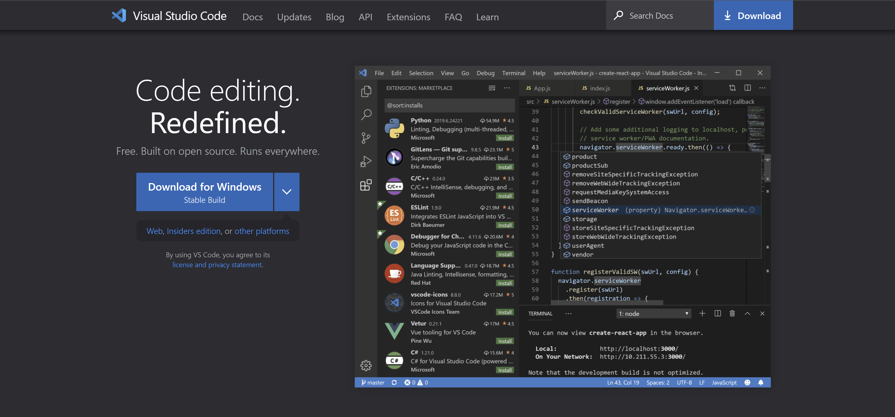

# **CSE 15L Lab Report 1- Remote Access Tutorial**

## Part One- Visual Studio Code Installation

Download VS Code via [this link] (https://code.visualstudio.com/)

Follow the installation steps from the website. (*Mac users may see a slightly different site than the picture below.*)


Opening up VS Code should bring you to a window that looks like this:


## Part Two- Remote Access

Download and install git.
[git for Windows](https://gitforwindows.org/)
[git for MacOS](https://git-scm.com/download/mac)

> To set git bash as your default terminal, follow this list of steps.
> 1. press ```CTRL + SHIFT + P``` to show all commands
> 2. type *Select Default Profile* 
> 3. 

In the VS Code window, press ``` CTRL + ` ``` to open up the terminal.


