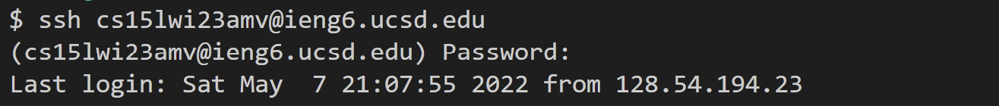
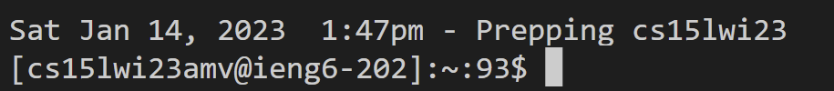
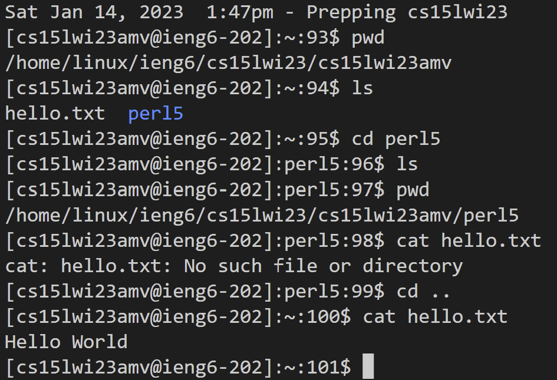

# **CSE 15L Lab Report 1- Remote Access Tutorial**

## Part One- Visual Studio Code Installation (skip if it has already been installed)

Download VS Code via [this link](https://code.visualstudio.com/)

Follow the installation steps from the website. (*Mac users may see a slightly different site than the picture below.*)


Opening up VS Code should bring you to a window that looks like this:


##### **Personal Process for Part One**
I already had VS Code installed from CSE 11, so I skipped this step entirely.

## Part Two- Remote Access

Download and install git.
[git for Windows](https://gitforwindows.org/)
[git for MacOS](https://git-scm.com/download/mac)

> To set git bash as your default terminal, follow this list of steps.
> 1. press ```CTRL + SHIFT + P``` to show all commands
> 2. type *Select Default Profile* and select "Git Bash"<br /> 
> 3. press ```CTRL + ` ```  to open up the terminal
> 4. to change terminal types <br /> `

##### **Personal Process for Installing Git**
I did not have git installed yet, so I followed the steps outlined above to download it and set it as my default profile in my VS Code terminal.

The next step is to remotely connect. In the VS Code terminal, type ```ssh cs15lwi23___@ieng6.ucsd.edu```.
The blank should be unique to each person.
Follow the instructions that will appear in your terminal.

> **To find your unique identifier**
> 1. [Click on this link](https://sdacs.ucsd.edu/~icc/index.php)
> 2. log in with your username and student ID
> 3. scroll down until you find this section <br /> 
> 4. note: you may need to change your passsword to set one up for the remote access process

##### **Personal Process for Remote Access**

This is what pops up for me. I had to additionally type in "yes" since I was connecting for the first time. I also had issues revolving around the password; changing the password changed the password for all my UCSD accounts rather than just that course specific account.


This is what appears for me after I log in.

<br /> *Side note: although the password section looks blank, the terminal is reading your keyboard inputs*

## Part Three- Trying Some Commands
Aftering gaining remote access, try out some commands.

| Command | Function | Example |
| :--- | :--- | :---|
| pwd | prints the working directory | [cs15lwi23amv@ieng6-202]:~:101$ pwd <br /> /home/linux/ieng6/cs15lwi23/cs15lwi23amv |
| cd | change directory | [cs15lwi23amv@ieng6-203]:~:121$ cd perl5 <br /> [cs15lwi23amv@ieng6-203]:perl5:122$ pwd <br /> /home/linux/ieng6/cs15lwi23/cs15lwi23amv/perl5|
| ls | lists files in the working directory | [cs15lwi23amv@ieng6-202]:~:102$ ls <br /> hello.txt  perl5 |


To logout, press ```CTRL + D```. This is what it looks like afterwards.
<br /> [cs15lwi23amv@ieng6-203]:perl5:123$ logout <br /> Connection to ieng6.ucsd.edu closed.

#### **Personal Process for Trying Some Commands**

<br /> This is what the current like in terminal looked like after I logged in remotely.

<br /> 
<br /> Here are the commands that I tried out. Mainly I just looked through the directory, changed the directory, and played around with making a file called Hello.txt that contained the phrase "Hello World."


