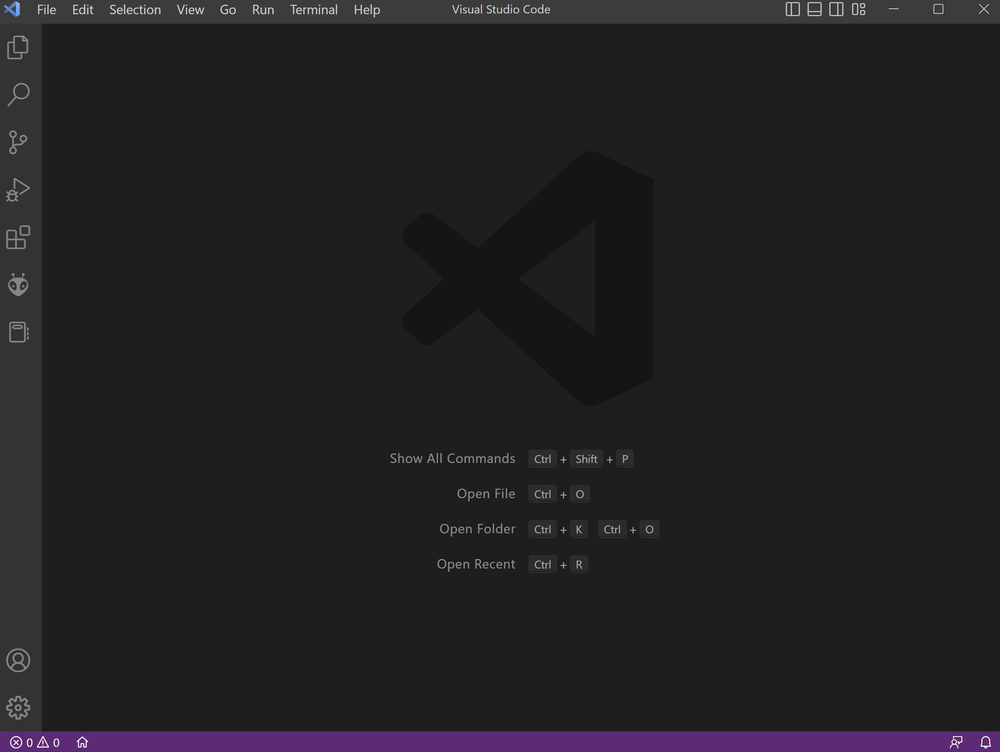
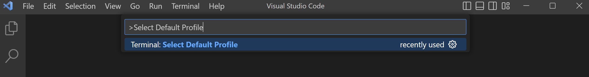
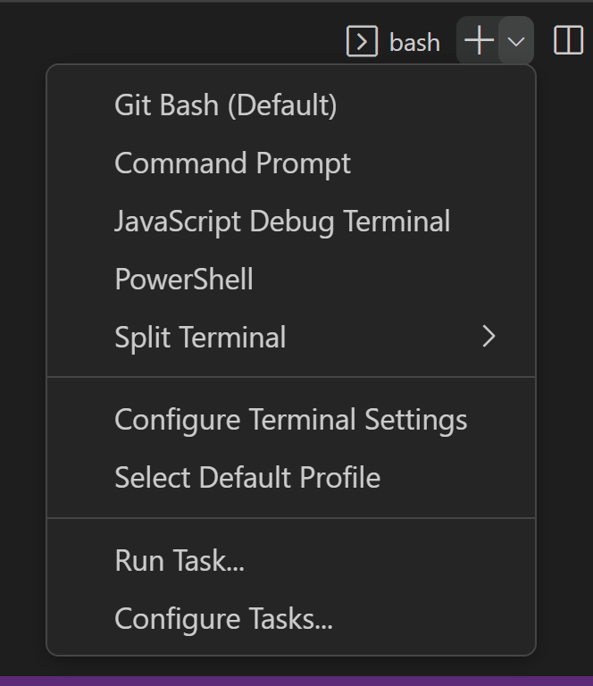
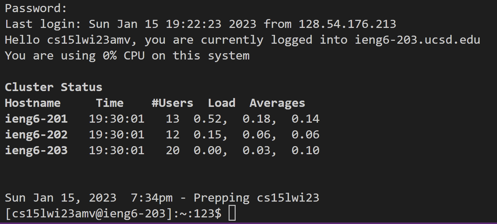

# **CSE 15L Lab Report 1- Remote Access Tutorial**

## Part One- Visual Studio Code Installation (skip if it has already been installed)

Download VS Code via [this link] (https://code.visualstudio.com/)

Follow the installation steps from the website. (*Mac users may see a slightly different site than the picture below.*)


Opening up VS Code should bring you to a window that looks like this:



##### Personal Process for Part One
I already had VS Code installed from CSE 11, so I skipped this step entirely.

## Part Two- Remote Access

Download and install git.
[git for Windows](https://gitforwindows.org/)
[git for MacOS](https://git-scm.com/download/mac)

> To set git bash as your default terminal, follow this list of steps.
> 1. press ```CTRL + SHIFT + P``` to show all commands
> 2. type *Select Default Profile* <br />  then select "Git Bash"
> 3. press ```CTRL + ` ```  to open up the terminal
> 4. to change terminal types <br /> `

##### Personal Process for Installing Git
I did not have git installed yet, so I followed the steps outlined above to download it and set it as my default profile in my VS Code terminal.

The next step is to remotely connect. In the VS Code terminal, type ```ssh cs15lwi23___@ieng6.ucsd.edu```.
The blank should be unique to each person.
> **To find your unique identifier**
> 1. [Click on this link](https://sdacs.ucsd.edu/~icc/index.php)
> 2. log in with your username and student ID
> 3. scroll down until you find this section
> 4. 

In the VS Code window, press ``` CTRL + ` ``` to open up the terminal.


