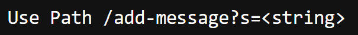
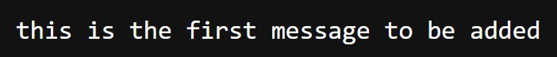
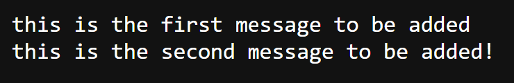
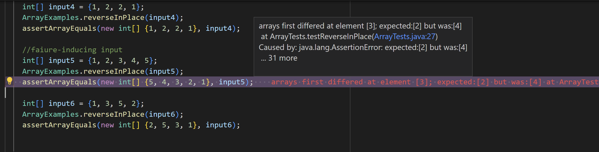
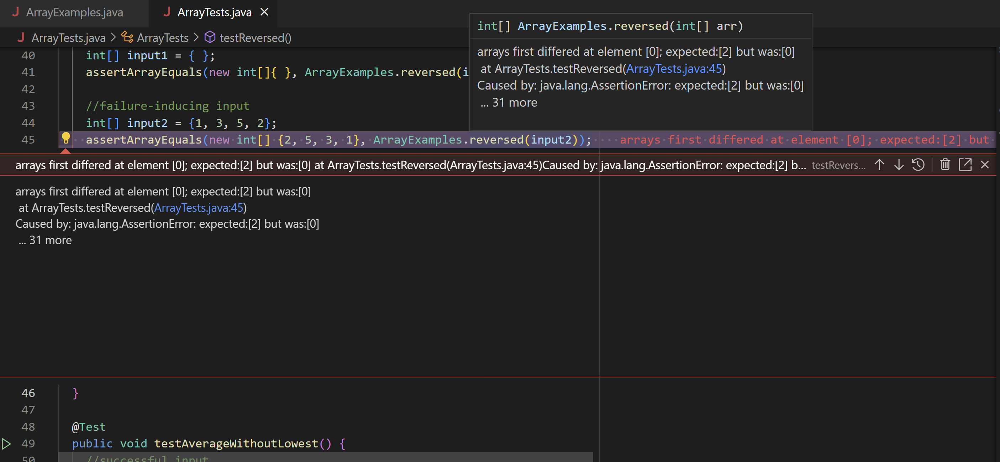
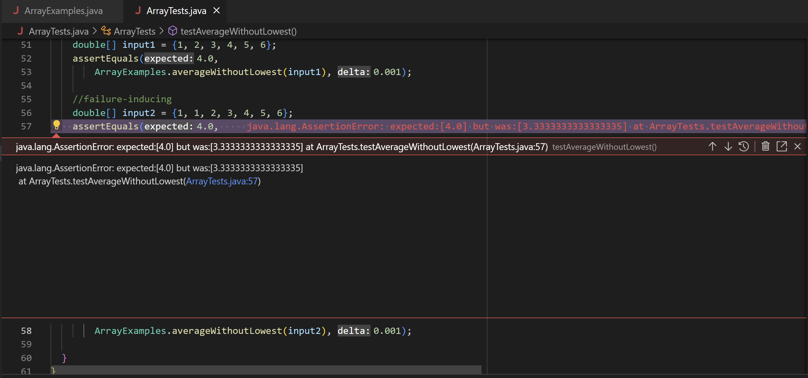

# **CSE 15L Winter 2023 Lab Report 2**
### Eric Song, Wednesday B270 1 p.m.
### Part 1: StringServer

StringServer.java Code:
```
import java.io.IOException;
import java.net.URI;


/**
 * ServerString objects implement the handleRequest method; this lets it
 * respond to changes in the URL.
 */
class ServerString implements URLHandler {
    // The one bit of state on the server: a number that will be manipulated by
    // various requests.
    
    private static final int INITIAL = 0;
    private static final int DEFAULT_END = 2;
    private static final int ADDED_STRING = 1;
    String overallMessage = "";
    boolean firstMessage = true;

    /**
     * Determines the different responses based on how the URL is changed in
     * the browser.
     * 
     * @param url the URL being processed
     */
    public String handleRequest(URI url) {
        if (url.getPath().equals("/add-message")) {
            String query = url.getQuery();
            //check for valid query
            try {
                if (query.substring(INITIAL, DEFAULT_END).equals("s=")) {
                    //valid query, add query string to overlal string
                    String message = query.split("=")[ADDED_STRING];
                    overallMessage += message + "\n";

                    //return overall string
                    return overallMessage;
                } else {
                    //invalid query
                    return "Invalid Query";
                }
            } catch (Exception E) {
                return "Invalid Query";
            }
        } else if (firstMessage == true) {
            firstMessage = false;
            return "Use Path /add-message?s=<string>";
        } else {
            return "Invalid URL\nCurrent Strings:\n" + overallMessage;
        }

    }
}

/**
 * Runs the StringServer.
 */
class StringServer {
    public static void main(String[] args) throws IOException {
        if(args.length == 0){
            System.out.println("Missing port number! Try any number between 1024 to 49151");
            return;
        }

        int port = Integer.parseInt(args[0]);

        Server.start(port, new ServerString());
    }
}
```
### `/add-message` demonstrations:
<br /> C:\Users\19255\Documents\GitHub\cse15l-lab-reports\lab-reports\lab-report-two>java StringServer 4000
<br /> Server Started! Visit http://localhost:4000 to visit.
#### Initial State (before any strings are added): http://localhost:4000/
<br /> 
#### Screenshot 1: http://localhost:4000/add-message?s=this%20is%20the%20first%20message%20to%20be%20added


>The method being called in StringServer.java is `handleRequest`.  
>The relevant argument to this method is the `URI url`.  
>Values of Relevant Fields:  
>`url`: http://localhost:4000/add-message?s=this%20is%20the%20first%20message%20to%20be%20added --> url input  
>`overallMessage`: ""  --> changes to "this is the first message to be added\n"  
>`firstMessage`: false --> stays false  
>the overallMessage String changes because the query is adding a string; the firstMessage boolean is the same because it is no longer the firstMessage  

#### Screenshot 2: http://localhost:4000/add-message?s=this%20is%20the%20second%20message%20to%20be%20added!


>The method being called in StringServer.java is `handleRequest`.  
>The relevant argument to this method is the `URI url`.  
>Values of Relevant Fields:  
>`url`: http://localhost:4000/add-message?s=this%20is%20the%20second%20message%20to%20be%20added! --> url input  
>`overallMessage`: ""  --> changes to "this is the first message to be added\nthis is the second message to be added!\n"  
>`firstMessage`: false --> stays false  
>the overallMessage String changes because the query is adding a string; the firstMessage boolean is the same because it is no longer the firstMessage

### Part 2: Bug Fixes for ArrayExamples.java  
**Failure-Inducing Inputs:**  
```
import static org.junit.Assert.*;
import org.junit.*;

public class ArrayTests {
	@Test 
	public void testReverseInPlace() {
    //successful input
    int[] input1 = { 3 };
    ArrayExamples.reverseInPlace(input1);
    assertArrayEquals(new int[]{ 3 }, input1);

    int[] input2 = {1, 1};
    ArrayExamples.reverseInPlace(input2);
    assertArrayEquals(new int[]{ 1, 1 }, input2);

    int[] input3 = {1, 3, 5, 3, 1};
    ArrayExamples.reverseInPlace(input3);
    assertArrayEquals(new int[]{1, 3, 5, 3, 1}, input3);

    int[] input4 = {1, 2, 2, 1};
    ArrayExamples.reverseInPlace(input4);
    assertArrayEquals(new int[] {1, 2, 2, 1}, input4);

    //faiure-inducing input
    int[] input5 = {1, 2, 3, 4, 5};
    ArrayExamples.reverseInPlace(input5);
    assertArrayEquals(new int[] {5, 4, 3, 2, 1}, input5);

    int[] input6 = {1, 3, 5, 2};
    ArrayExamples.reverseInPlace(input6);
    assertArrayEquals(new int[] {2, 5, 3, 1}, input6);

    
  }


  @Test
  public void testReversed() {
    //successful input
    int[] input1 = { };
    assertArrayEquals(new int[]{ }, ArrayExamples.reversed(input1));

    //failure-inducing input
    int[] input2 = {1, 3, 5, 2};
    assertArrayEquals(new int[] {2, 5, 3, 1}, ArrayExamples.reversed(input2));
  }

  @Test
  public void testAverageWithoutLowest() {
    //successful input
    double[] input1 = {1, 2, 3, 4, 5, 6};
    assertEquals(4.0, 
        ArrayExamples.averageWithoutLowest(input1), 0.001);

    //failure-inducing
    double[] input2 = {1, 1, 2, 3, 4, 5, 6};
    assertEquals(4.0, 
        ArrayExamples.averageWithoutLowest(input2), 0.001);
    
  }
}
```
<br /> The above block of code contains the JUnit tests for ArrayExamples.java   

#### Symptoms for reverseInPlace  
  
Based on the JUnit tests done on this method, it seems that it only works as intended when the input array is palindromic.  
This suggests that there is an error in how the array is being copied.  

#### Symptoms for reversed  
  
Based on the JUnit tests, it seems that the contents of the array being output are only 0s.  
This suggests that there is an error in copying the contents of one array to another.  

#### Symptoms for averageWithoutLowest  
  
Based on the JUnit test show above, there is an error in finding the average.  
The hand-calculated value is larger than the returned value; this suggests that perhaps there is an error in how the sum is divided.  

### Bug Fixes:  
reverseInPlace:  
*Before*
```
  static void reverseInPlace(int[] arr) {
    for(int i = 0; i < arr.length; i += 1) {
      arr[i] = arr[arr.length - i - 1];
    }
  }
```


